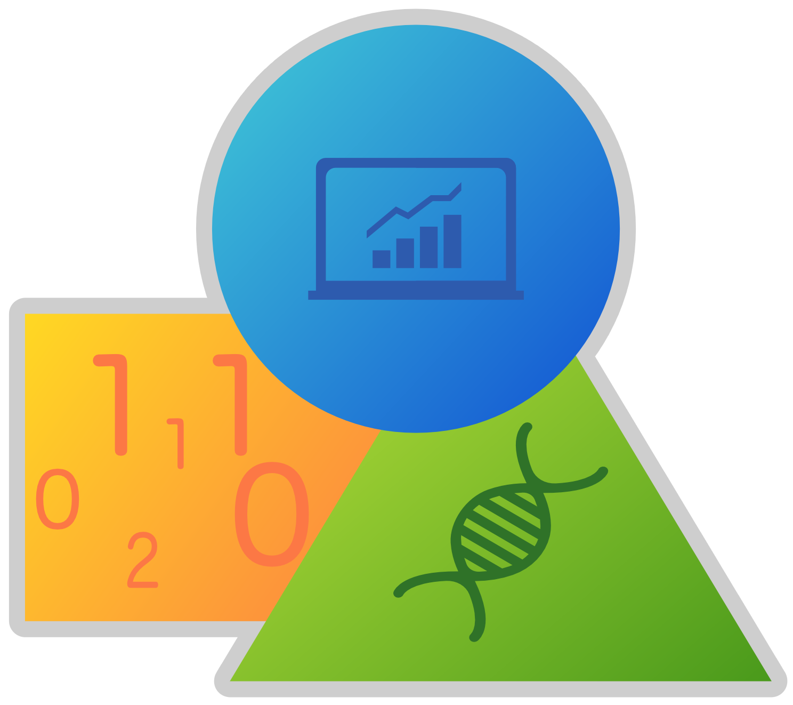

```{r setup, include=FALSE}
knitr::opts_chunk$set(echo = TRUE)
```

## MODULE description 

This is the first out of four modules in the data science program newly introduced into the Bachelor Programs of the **Biology Department, University of Hamburg**, which I'm coordinating. *Data Science 1* gives an overview of the topic and program and introduces students into the open-source spreadsheet program *Calc* and particularly into the world of programming and visualizing in R.


## This repository

This Github repository holds just the course-specific HTML lecture slides (all in German) produced with R Markdown. The actual course website can be found here: [https://datasciencebiology.blogs.uni-hamburg.de](https://datasciencebiology.blogs.uni-hamburg.de/course-portfolio/data-science-1/)


## License

<a rel="license" href="http://creativecommons.org/licenses/by-sa/4.0/">
  
</a>

This work is licensed under a [Creative Commons Attribution-ShareAlike 4.0 International License ](http://creativecommons.org/licenses/by-sa/4.0/) except for the borrowed and mentioned with proper *source:* statements.

